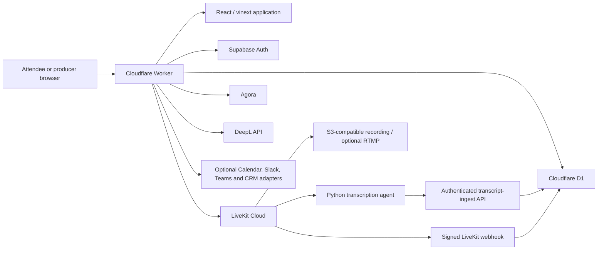

# Velocity Venue — Project and Technical Brief

Prepared for Cris

Canonical submission URL: https://virtualvelocity.avajesh6.workers.dev
Source repository: https://github.com/avajesh6/virtualvelocity

## 1. Executive summary

Velocity Venue is a two-sided virtual-event platform that combines a polished attendee venue with a live producer command center.

Attendees can enter event rooms, join real video sessions, chat, participate in polls and Q&A, network with consent, request support, explore sponsors, view captions, choose translated caption languages, and revisit searchable conference content. Producers can operate the event in real time through a protected control center with room health, participant controls, run-of-show management, announcements, support tickets, engagement moderation, recording, streaming, replay publishing, event intelligence, and Rescue Mode.

The application deliberately separates **Live mode** from **Demo mode**:

- Live mode uses configured services and persisted production data. It never substitutes fabricated participants, schedules, provider results, or successful actions.
- Demo mode is an isolated browser-local product tour. It does not request media permissions, contact providers, persist records, or affect live users.

## 2. Submission links

- Live application: https://virtualvelocity.avajesh6.workers.dev
- In-app product guide: https://virtualvelocity.avajesh6.workers.dev/docs
- GitHub repository: https://github.com/avajesh6/virtualvelocity

The Workers URL above is the canonical submission target. Older preview or Sites URLs are not submission artifacts.

## 3. Product capabilities

### Attendee experience

- Venue lobby with Main Stage, Studio One, Expo Room, and Connection Lounge
- LiveKit video conferencing with device preview and device selection
- Optional Agora audio/video path
- Participant grid, chat, screen sharing, connection state, and room invite links
- Live captions with server-side DeepL translation
- Polls, ranked Q&A, reactions, and hand raising
- Opt-in attendee profiles and interest-based networking
- Connection requests and scheduled introductions
- Sponsor resource discovery and consented lead sharing
- Support-ticket creation and status tracking
- Transcript search, replay discovery, conference summaries, and chapters
- Light/dark themes, reduced-motion support, reduced-data preference, keyboard navigation, and responsive layouts

### Producer command center

- Supabase-authenticated producer access
- Live room counts and participant monitoring
- Participant mute and removal controls
- Run-of-show creation and live status advancement
- Venue-wide announcements
- Persisted support queue with assignment and resolution
- Live polls and Q&A moderation
- LiveKit webhook-derived telemetry and operational recommendations
- Egress recording to S3-compatible storage
- Optional RTMP simulcast
- Replay and sponsor publishing
- Transcript import and conference-memory generation
- Rescue Mode for moving participants to a backup room
- Append-only audit history and incident records

## 4. High-level architecture

The browser receives short-lived room tokens, never provider signing credentials. All protected producer operations are re-authorized on the server.

## 5. Technology stack

| Layer | Technology | Role |
| --- | --- | --- |
| Language | TypeScript | Application, APIs, Worker runtime, database schema |
| UI | React 19.2.8 | Interactive attendee and producer experiences |
| Application framework | Next.js 16.2.12 through vinext 0.0.50 | App Router, React Server Components, server routes |
| Build system | Vite 8.1.5 | Client/server/Worker production builds |
| Edge runtime | Cloudflare Workers | Globally distributed application and API hosting |
| Cloudflare integration | Cloudflare Vite plugin 1.47.0 and Wrangler 4.114.0 | Local runtime, bindings, deployment, operations |
| Database | Cloudflare D1 | Durable SQLite-compatible operational data |
| ORM and migrations | Drizzle ORM 0.45.2 / Drizzle Kit 0.31.10 | Typed schema, queries, and migrations |
| Authentication | Supabase JS 2.110.8 | Email/password and Google OAuth sessions |
| Primary media | LiveKit client/server SDKs and React components | Rooms, media, chat, screen sharing, webhooks, Egress |
| Alternative media | Agora RTC SDK and server token builder | Optional audio/video path |
| Caption translation | DeepL API | Server-side translation of finalized captions |
| Transcription service | Python 3.10+, LiveKit Agents, LiveKit Inference, aiohttp | STT-only captions and authenticated transcript ingestion |
| Icons | Lucide React | Consistent application iconography |
| Styling | Application CSS and Tailwind PostCSS toolchain | Responsive themes, layouts, states, and accessibility |
| Tests | Node.js built-in test runner | Route contracts, security behavior, build and live HTTP checks |
| Static quality | TypeScript and ESLint | Type safety and lint validation |
| CI | GitHub Actions | Locked install, lint, production build, and tests on every main push |
| Production publishing | Cloudflare native Git integration | Sole publisher for the canonical Worker |

### Patched dependency controls

Production uses Next.js 16.2.12 with explicit patched overrides for PostCSS 8.5.24 and Sharp 0.35.3. The production dependency audit reports zero known vulnerabilities at submission time.

## 6. Runtime topology and deployment

The canonical application is deployed as the Cloudflare Worker:

`virtualvelocity.avajesh6.workers.dev`

A push to `main` starts two coordinated systems:

1. GitHub Actions installs the locked dependency graph, runs lint, builds the production Worker, and executes the complete test suite.
2. Cloudflare's native Git integration publishes the validated source to the Worker.

Only Cloudflare publishes production. GitHub Actions intentionally has no Cloudflare deployment token, preventing duplicate or competing releases.

Cloudflare bindings provide:

- D1 database binding: `DB`
- Public LiveKit and Supabase URLs
- Server-side LiveKit and Agora credentials
- DeepL API credential
- Producer allowlist
- Recording storage configuration
- Transcript-ingest credential

Database migrations are reviewed and applied explicitly. They are not run automatically during code deployment.

## 7. Authentication and authorization

Supabase provides email/password and Google OAuth authentication.

Authentication and authorization are separate:

- Supabase identifies the account.
- Producer access requires `app_metadata.role` equal to `producer` or `admin`, or an email in the server-side `PRODUCER_EMAILS` allowlist.
- Every producer API validates the bearer token and role independently.
- Attendee identity used for leads and support requests comes from the verified session rather than untrusted form fields.
- LiveKit and Agora tokens are limited to the four allowlisted venue rooms.

## 8. Media, captions, and translation

### LiveKit

LiveKit is the primary media provider. It supplies:

- Pre-join device preview
- Audio/video rooms
- Participant and connection state
- Chat and screen sharing
- Server-side participant administration
- Signed webhooks
- Egress recording and streaming
- Transcription text streams

### Agora

Agora is an optional attendee-selectable audio/video path. The server creates a unique numeric UID and a one-hour publisher token for an allowlisted venue channel. LiveKit remains responsible for chat, screen sharing, captions, webhook telemetry, recording, and Rescue Mode.

### Transcription agent

The separate `transcription-agent/` service is an STT-only LiveKit Cloud agent. It:

- Wakes for allowlisted venue rooms
- Creates a transcription session for each remote participant
- Uses LiveKit Inference with the configured Deepgram Nova model
- Publishes caption text into LiveKit
- Sends finalized segments to the Worker's authenticated `/api/transcript-ingest` endpoint
- Never generates an LLM reply

### DeepL translation

Finalized captions are posted to `/api/translation`. The Worker calls DeepL server-side, keeping the API key out of the browser. API Free keys automatically use DeepL's free endpoint. Supported target languages are Spanish, French, German, and Japanese. A private translation webhook can be configured as a fallback.

## 9. Persistence model

Cloudflare D1 stores the operational source of truth.

| Table | Purpose |
| --- | --- |
| `leads` | Consented expo interest and CRM-routing input |
| `incidents` | Service-impacting events and recovery outcomes |
| `audit_events` | Append-only producer and integration history |
| `run_of_show_items` | Ordered event schedule and live status |
| `support_tickets` | Attendee requests and producer lifecycle |
| `attendee_profiles` | Preferences, accessibility settings, and networking consent |
| `engagement_items` | Polls and questions |
| `engagement_votes` | Idempotent votes, answers, and reactions |
| `connection_requests` | Networking requests and scheduled meetings |
| `sponsor_interactions` | Sponsor actions with explicit consent |
| `sponsor_booths` | Published sponsor content |
| `telemetry_events` | Idempotent LiveKit webhook history |
| `recording_jobs` | Egress recording state and playback metadata |
| `transcript_segments` | Finalized caption text |
| `content_assets` | Replays, summaries, chapters, and published assets |

Live mode does not seed sample rows. Empty data remains an honest empty state.

## 10. API surface

### Public and attendee-facing routes

| Route | Purpose |
| --- | --- |
| `POST /api/livekit-token` | Short-lived token for an allowlisted LiveKit room |
| `POST /api/agora-token` | One-hour Agora token for an allowlisted channel |
| `POST /api/translation` | DeepL or private-adapter caption translation |
| `GET /api/venue` | Room totals, service status, agenda, and announcements |
| `POST /api/livekit-webhook` | Signed, idempotent provider event ingestion |
| `POST /api/transcript-ingest` | Authenticated finalized-caption ingestion |
| `POST /api/leads` | Persist and optionally route consented sponsor interest |
| `GET/POST /api/support` | Create and review attendee support requests |
| `GET/POST /api/experience` | Engagement, networking, transcripts, sponsors, and replays |
| `GET /api/auth/me` | Verified session and effective role |

### Producer routes

| Route | Purpose |
| --- | --- |
| `GET/POST /api/producer/room` | Participants, mute, removal, and Rescue Mode |
| `GET/POST /api/producer/operations` | Run of show, announcements, support, audit, incidents |
| `POST /api/producer/integrations` | Calendar and team-message dispatch |
| `GET/POST /api/producer/intelligence` | Telemetry, moderation, recording, replay, memory |

Responses distinguish invalid requests, unauthenticated access, insufficient roles, missing records, rate limits, provider failure, and unavailable configuration.

## 11. External integrations

### Active for the canonical submission deployment

- Cloudflare Workers and D1
- Supabase email/password and Google OAuth
- LiveKit media and server APIs
- Agora token issuance
- DeepL caption translation
- LiveKit transcription agent
- S3-compatible recording destination

### Adapter-ready and optional

- Calendar webhook
- Slack webhook
- Microsoft Teams webhook
- HubSpot, Salesforce, generic CRM, Zapier, Make, or internal CRM ingestion
- RTMP destinations
- Private generative conference-memory service

Optional adapters remain visibly unavailable until their production URLs are configured. The application never claims an external delivery that did not occur. Conference memory has a deterministic local extractive fallback and does not require an AI provider.

## 12. Security and privacy controls

- Provider credentials and webhook URLs remain server-side.
- Short-lived, room-scoped media tokens are generated by the Worker.
- Room names are allowlisted.
- Producer routes enforce Supabase authentication and role authorization.
- LiveKit webhooks require valid signatures and are idempotent.
- Transcript ingestion uses a dedicated bearer credential.
- D1 records real operational state; Demo mode cannot mutate production.
- Sponsor sharing requires affirmative consent.
- Networking profiles are opt-in.
- Irreversible producer actions use confirmation dialogs.
- Rate limits and payload-length limits protect public mutation routes.
- Provider timeouts and failures return controlled errors.
- Responses include CSP, HSTS, frame protection, MIME-sniffing protection, referrer policy, permissions policy, and cross-origin policy headers.
- Production dependencies are locked and audited.
- Real `.env` files, local credentials, and caches are ignored by Git.

## 13. Reliability and failure behavior

- A missing provider is shown as unconfigured, not as a false success.
- D1 failure does not fabricate data.
- Rescue Mode prioritizes participant recovery even if audit persistence is temporarily unavailable.
- Integration delivery and local persistence are reported independently.
- Webhook retries do not duplicate telemetry.
- Translation has explicit invalid-key, rate-limit, quota, timeout, and malformed-response handling.
- The live HTTP suite includes a representative concurrent request burst.

## 14. Validation completed for submission

- Clean `main` branch synchronized with GitHub
- Locked production build succeeds
- TypeScript check passes
- ESLint passes
- Application contract and failure-path tests pass
- Live HTTP smoke and concurrency tests pass
- Cloudflare D1 has no pending migrations
- LiveKit token issuance passes
- Agora token issuance passes
- DeepL translation passes
- Supabase settings endpoint confirms email and Google authentication
- LiveKit transcription agent is deployed and available
- Production dependency audit reports zero vulnerabilities
- No real environment or credential files are tracked

## 15. Suggested demonstration for Cris

1. Open the canonical URL.
2. Switch to **Demo** and point out the persistent “DEMO DATA · NO LIVE IMPACT” label.
3. Open Main Stage and exercise simulated microphone, camera, captions, screen share, and leave controls.
4. Open Polls & Q&A, vote, submit a question, and show reactions.
5. Open Networking, edit the opt-in profile, accept a request, and schedule an introduction.
6. Open the conference-memory area and search/export sample content.
7. Select **Producer demo**.
8. Show room health, the run of show, support queue, poll moderation, recording controls, event intelligence, and Rescue Mode.
9. Switch back to **Live** and explain that live actions require real providers and producer authorization.
10. If a live rehearsal room is available, demonstrate token issuance, captions, and translated captions with two participants.

## 16. Submission positioning

Velocity Venue is not a static event mockup. It is a production-oriented operations platform with explicit trust boundaries, real persistence, real provider integrations, observable failure states, consent controls, and an isolated evaluation mode.

The strongest differentiators are:

- One product for both attendees and event operators
- Honest separation between live data and demo data
- Real-time operational recovery through Rescue Mode
- Durable telemetry, audit, support, engagement, transcript, and recording history
- Multiple media-provider options
- Server-side multilingual caption translation
- Security-conscious provider and authorization boundaries
- A deployment model designed to avoid duplicate publishers and false release states

## 17. Known submission notes

- The canonical Workers URL should be submitted; older preview URLs should not be used.
- A custom domain is intentionally deferred until the test submission is accepted.
- Calendar, Slack, Teams, CRM, RTMP, and private memory adapters are optional and should be described as adapter-ready unless configured for the demonstration.
- A full live event rehearsal still requires real participants, media consent, and producer credentials; Demo mode exists so reviewers can evaluate the complete product safely without those dependencies.
